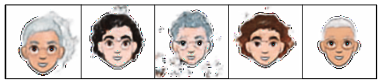
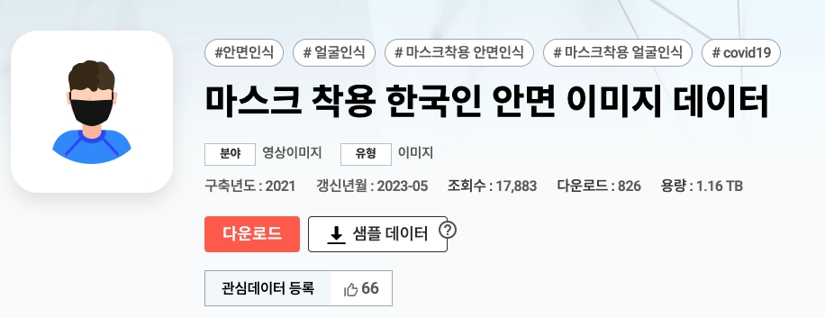

# Avatar Image Generator for Korean

   Generated Cartoons <br/>
   

   Based on the paper XGAN: https://arxiv.org/abs/1711.05139

## The problem

This repo aims to contribute to the daunting problem of generating a cartoon given the picture of a face.  <br/> <br/>
This is an image-to-image translation problem, which involves many classic computer vision tasks, like style transfer, super-resolution, colorization and semantic segmentation. Also, this is a many-to-many mapping, which means that for a given face there are multiple valid cartoons, and for a given cartoon there are multiple valid faces too. </br>

In this work, I adjusted the model to better fit a dataset of Korean faces.
</br>

## Dataset

  Korean faces dataset: we use dataset (https://www.aihub.or.kr/aihubdata/data/view.do?&dataSetSn=469) by extracting only people who do not use masks from AI Hub datset

  

  Cartoon dataset: we use the CartoonSet dataset from Google (https://google.github.io/cartoonset/), both the versions of 10000 and 100000 items.
  
  We filtered out the data just to keep realistic cartoons and faces images. This code is in `scripts`. To download the dataset:
  
  1. `pip3 install gdown`
  2. `gdown https://drive.google.com/uc?id=1tfMW5vZ0aUFnl-fSYpWexoGRKGSQsStL`
  3. `unzip datasets.zip`

## Directory structure
```
├── api.py
├── config.json
├── images
│   ├── Cartoons_example.jpeg
│   └── Faces_example.jpeg
├── LICENSE
├── losses
│   └── __init__.py
├── models
│   ├── avatar_generator_model.py
│   ├── cdann.py
│   ├── decoder.py
│   ├── denoiser.py
│   ├── discriminator.py
│   ├── encoder.py
│   └── __init__.py
├── README.md
├── requirements.txt
├── scripts
│   ├── copyFiles.sh
│   ├── download_faces.py
│   ├── keepFiles.sh
│   ├── plot_utils.py
│   └── preprocessing_cartoons_data.py
├── train.py
├── preprocess.py
├── utils
│   └── __init__.py
└── weights

```
